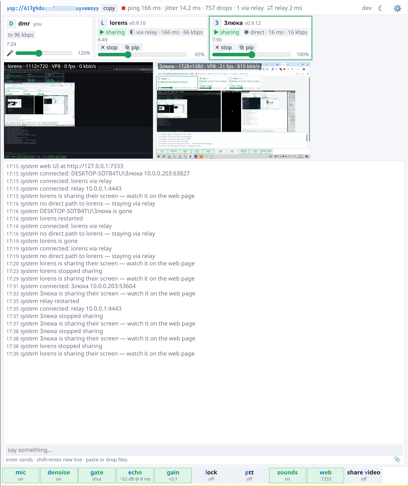
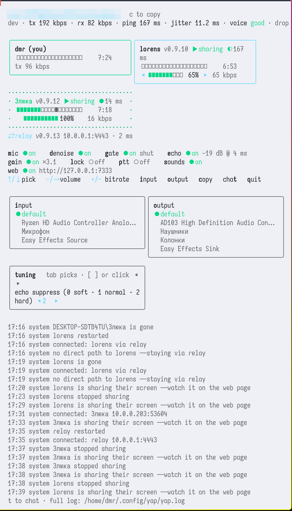

# yap

Group voice call for friends. One static binary, no accounts, no servers
to run (a relay is optional), nothing to install for the people you call:
send them a link, they run the same binary, you talk.

```
yap                     # host a room: the link lands in your clipboard, send it around
yap join yap://…        # friends run this (or click the link — yap:// opens yap)
```

What you get, all in that one binary:

- **Voice** that sounds like a call, not a walkie-talkie: Opus 48 kHz (12–160 kbps,
  live), RNNoise denoise, noise gate, auto-gain, mic gain, push-to-talk, per-person
  volume, join/leave chimes. Echo cancellation is the WebRTC canceller Chrome used
  until 2018: it finds the speaker-to-mic delay on its own, rides clock drift and
  suppresses what is left — speakers without headphones are fine.
- **Chat** in the same window, with files: paste a picture, drop anything on the
  chat, pictures show inline and open full screen.
- **Screen sharing** from the web page: VP8/VP9 up to 1080p 30 fps, any number of
  people at once, watch inline, full screen or in a picture-in-picture window.
  Frames go only to those who press *watch*; bitrate backs off when a viewer
  loses frames. The browser captures and encodes (WebCodecs), so it works on
  Wayland, Windows and macOS alike.
- **Two faces**: a terminal UI and a web page on `127.0.0.1:7333` with the same
  switches (on Windows the page opens by itself). Both show everyone's level,
  ping, jitter, bitrate, version and talk time.
- **Peer to peer**, encrypted (ChaCha20-Poly1305, a key per pair). Rendezvous
  through ntfy topics derived from the link, STUN for public addresses, UDP
  hole punching. When two people cannot reach each other, a relay forwards
  between them without being able to listen — and one packet up serves everyone
  behind that relay. Opus in-band FEC covers lost packets.
- Room lock, `yap://` links that open yap from a browser or chat, self-update
  (`yap update`), connection stats (`yap stats`).





## Using it

**Terminal.** `↑/↓` pick a person, `←/→` their volume (yours: mic gain), `+/-`
your bitrate, `m` mute, `d` denoise, `g` gate, `e` echo cancel, `a` auto-gain,
`p` push-to-talk (hold space), `l` lock the room, `s` sounds, `w` the web page,
`i` / `o` microphone and speakers (a tile with the choices), `tab` the tuning
tile, `c` copy the link, `t` or `Enter` chat, `q` quit. The keys work in any
keyboard layout; the mouse works on tiles and labels.

**Web page.** Same switches on the bottom bar with the hot letters marked;
cards with volume sliders; ⚙ has devices, bitrate, echo suppression, screen
share settings (codec, size, frame rate, bitrate), stats and the log; ☾/☀
light and dark. *share video* (`v`) starts sharing; on someone else's card
*watch* shows their screen under the cards, *pip* pops it out into a floating
window. Paste a link into the *join* field to move to another room.

**Names.** `-name` sets what others see (default: your user name). Two people
with the same name in one room replace each other — pick different ones.

**Where things live.** `<config dir>/yap/`: `link`, `settings.json` (devices,
switches, per-person volumes by name, theme), `files/` (what was sent in the
chat), `yap.log` and `stats.jsonl`. `~/.config/yap` on Linux,
`~/Library/Application Support/yap` on macOS, `%AppData%\yap` on Windows. Send
the log when something goes wrong; `yap reset` forgets the settings.

**Relay.** Anyone with a public port can host one:

```
yap relay -p 4443 yap://…     # headless, forwards for everyone on that link
```

It announces itself like a participant, everyone uses it as a fallback the
moment they join (direct paths are tried in the background and taken when they
work), it hears nothing, and it updates itself when the room is empty.

## Download

Each tagged release has prebuilt binaries: `yap-macos` (universal),
`yap-linux-amd64`, `yap-linux-arm64` and `yap-windows-amd64.exe`. Grab one,
`chmod +x` (not on Windows), run it. On macOS a browser download is quarantined:
fetch it with `curl -L` or clear it with `xattr -d com.apple.quarantine yap-macos`.
Everyone in a call should run the same version; `yap update` fetches the latest
release for your OS and replaces the binary in place, and every start checks
GitHub and says when a newer one exists.

## Build

Needs Go, a C/C++ compiler and libopus (`pacman -S opus`, `brew install opus`,
msys2 `mingw-w64-x86_64-opus`). Everything else (RNNoise, the WebRTC echo
canceller, the web page) is in the tree.

```
go build -tags nolibopusfile
```

`release.yml` builds all four binaries with libopus linked statically. When run
from the repository, the web page is read from `web/index.html` on every request,
so it can be edited live.
